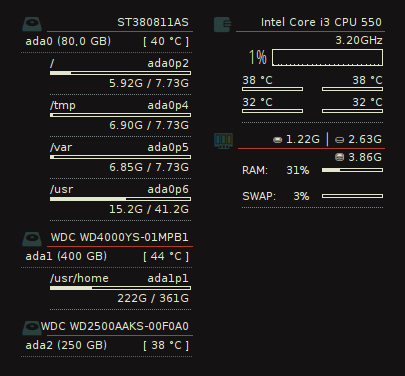

conky-hw-monitor
================

Conky configs and scripts for FreeBSD desktop that monitors the CPU & RAM
usage and CPU temperature. Also monitors of all connected storages (i.e.
HDD, SSD drives and USB-dongles) with all mounted filesistems. For HDD
drives shows the current temperature (in Celsius).

Requirements
------------

* `sysutils/smartmontools`   - for HDD
* `coretemp.ko / amdtemp.ko` - for the on-die digital thermal sensor
* `devel/lua-sysctl`         - for reading dev.cpu.X.temperature sysctl's

Usage
-----

First of all, install the `sysutils/smartmontools` and `devel/lua-sysctl`.
For `devel/lua-sysctl` remove the patch from the port, because this patch
for using with Lua 5.2 and Conky won't work correctly.

Load the corresponding kernel module for your CPU:

`kldload coretemp` - for Intel Core CPU's
`kldload amdtemp`  - for AMD CPU's

Add it to the loader.conf file:

	echo "coretemp_load=YES" >> /boot/loader.conf

or

	echo "amdtemp_load=YES" >> /boot/loader.conf

Get the project files to your computer:

	git clone https://github.com/digital-freak/conky-hw-monitor.git

And run the `hwmon.sh` sctipt

